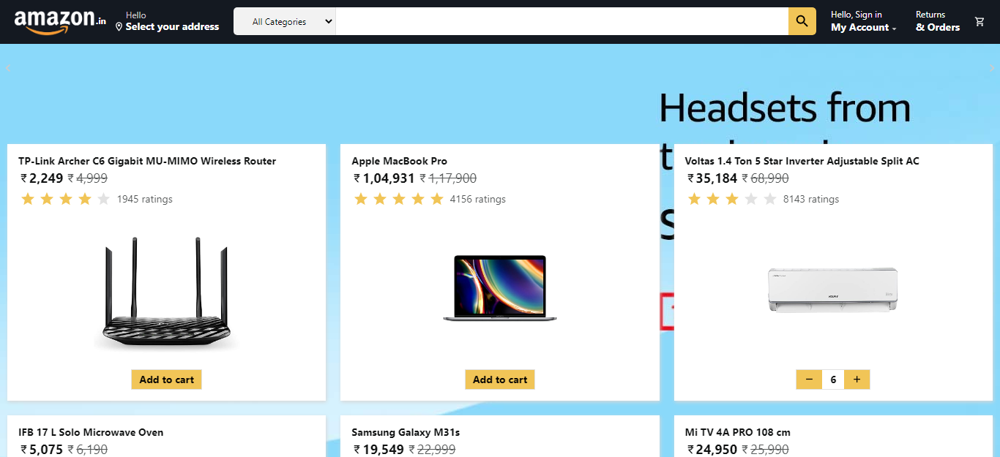
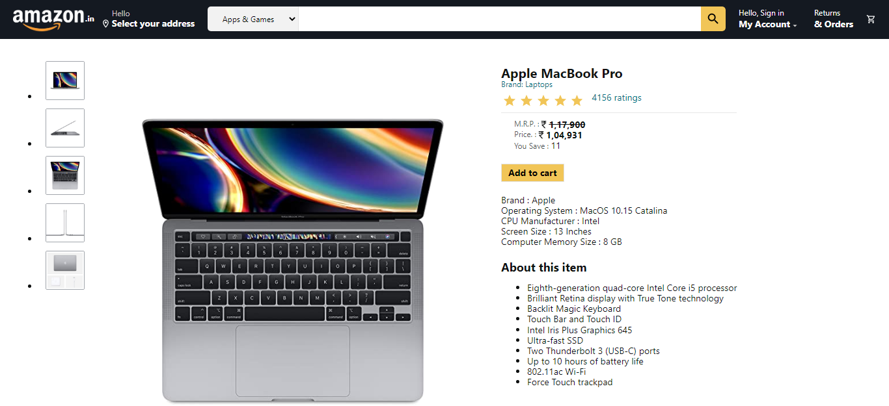
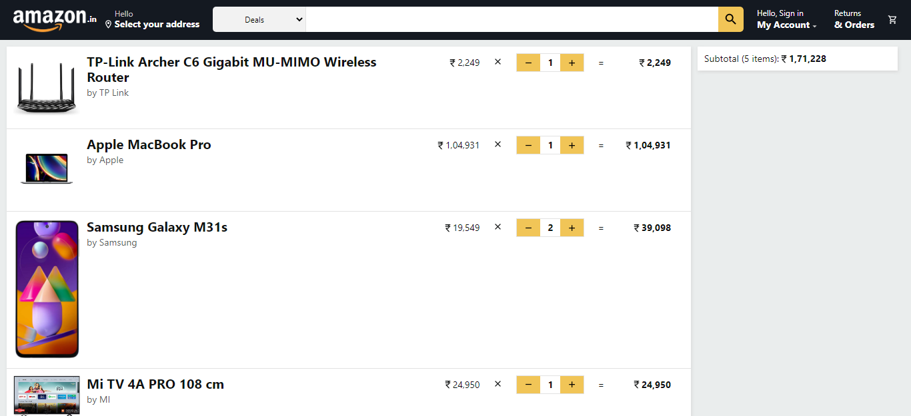

# Introduction

This is a clone of e-commerce site Amazon. Here customers can view different products, their prices, ratings and add, delete items to cart.

- The products, their ratings and prices are picked up using a mock API.

- Routing between different components is performed using React Router 6.

- Customer can add/remove items from the cart. The total items are displayed in the cart.

## Technologies Used

The application was bootstrapped with Vite.

- React
- React Router 6
- Context API
- SCSS
- Material-UI
- MockAPI

## Installation

- Fork or directly clone the repository in your local machine.
- Type the command `npm install` in the terminal. This will install all the dependencies.
- Use the command `npm start` to start the app. View the app in the browser on 'https://localhost:3000'.
